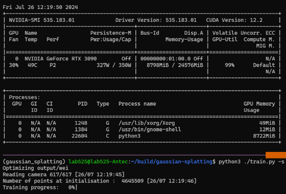

I wonder why there is no issue identify the memory leak problem. Maybe I am too lazy to look for it thoroughly on the internet.
Anyway, I found there is an apparent memory leak problem in the original implementation (the source code is available on [Github](https://github.com/graphdeco-inria/gaussian-splatting)).

I find the problem when I am working on loading a large dataset with around $600$ images and $4$ million points, jointly collected with accurate geometry mapping. And it simply takes up 20GB+ memory on the NVIDIA RTX 3090 GPU, and 15GB+ memory at the same time. While the scene is large indeed, I am curious why it takes up all the memory at the start, but not increasing w.r.t the training process!

## The First Patch - Lazy Loading

Firstly, I identify the cause of huge memory footprint on CPU (i.e., RAM usage): all the images are loaded in RAM with corresponding tensors on GPU. The related source code is in [`utils/camera_utils.py#L20`](https://github.com/graphdeco-inria/gaussian-splatting/blob/main/utils/camera_utils.py#L20):

```python
def loadCam(args, id, cam_info, resolution_scale, is_test_dataset):

  ...

  return Camera(resolution, colmap_id=cam_info.uid, R=cam_info.R, T=cam_info.T, 
                  FoVx=cam_info.FovX, FoVy=cam_info.FovY, depth_params=cam_info.depth_params,
                  image=image, invdepthmap=invdepthmap,
                  image_name=cam_info.image_name, uid=id, data_device=args.data_device,
                  train_test_exp=args.train_test_exp, is_test_dataset=is_test_dataset, is_test_view=cam_info.is_test)
```
My immediate thought is to do the tradeoff: the image loading time may not deserve so much memory consumption, especially considering the following up huge training burden.
Therefore, I compose a `LazyLoader` class to delay the instainiation of `Camera` class until the first reference. The example implementation is below:

```python
from scene.cameras import Camera

class LazyLoader:
    def __init__(self, cls, *args, **kwargs):
        self.cls = cls
        self.args = args
        self.kwargs = kwargs
        self.instance = None
        pass

    def __getattribute__(self, name: str):
        if name in ['cls', 'args', 'kwargs', 'instance']:
            return super().__getattribute__(name)
        else:
            if not self.instance:
                self.instance = self.cls(*self.args, **self.kwargs)
            return getattr(self.instance, name)

    def __del__(self):
        if self.instance:
            del self.instance
        pass

    pass
```

The original reference of `Camera` class build is therefore revised as:
```diff
-    return Camera(colmap_id=cam_info.uid, R=cam_info.R, T=cam_info.T, 
+    return LazyLoader(Camera, colmap_id=cam_info.uid, R=cam_info.R, T=cam_info.T, 
```

And after the usage in the main training loop in `train.py`, the image could be immediately deleted, until created at the next usage.
```diff
             # Loss
             gt_image = viewpoint_cam.original_image.cuda()
+            del viewpoint_cam
             Ll1 = l1_loss(image, gt_image)
             loss = (1.0 - opt.lambda_dssim) * Ll1 + opt.lambda_dssim * (1.0 - ssim(image, gt_image))
             loss.backward()
```

However, the weird thing is, the memory usage does start with an acceptable amount at the start with image loading one-by-one as expected. But it finally grows up to 20GB+ and then never decreases. So I realized the real problem here is, the memory leak.

## The Second Patch - Memory Leak Fix

The memory leak here is very confusing. As I mentioned before, I use `del` to remove the reference to the `Camera` class in Python, and all the held memory should be wiped out at the same time. I have tried to search for the cause everywhere but only to find out it is related to PyTorch. Since I could not dig into the CUDA tensor things, I started to try to `del` everything related in Python code. Luckily, it turns out to work.

The patch could be broken down into two parts. The first part is to improve the efficiency of image loading:

```diff
diff --git a/scene/__init__.py b/scene/__init__.py
--- a/scene/__init__.py
+++ b/scene/__init__.py
@@ -37,9 +37,6 @@ class Scene:
                 self.loaded_iter = load_iteration
             print("Loading trained model at iteration {}".format(self.loaded_iter))
 
-        self.train_cameras = {}
-        self.test_cameras = {}
-
         if os.path.exists(os.path.join(args.source_path, "sparse")):
             scene_info = sceneLoadTypeCallbacks["Colmap"](args.source_path, args.images, args.eval)
         elif os.path.exists(os.path.join(args.source_path, "transforms_train.json")):
@@ -67,12 +64,8 @@ class Scene:
             random.shuffle(scene_info.test_cameras)  # Multi-res consistent random shuffling
 
         self.cameras_extent = scene_info.nerf_normalization["radius"]
-
-        for resolution_scale in resolution_scales:
-            print("Loading Training Cameras")
-            self.train_cameras[resolution_scale] = cameraList_from_camInfos(scene_info.train_cameras, resolution_scale, args)
-            print("Loading Test Cameras")
-            self.test_cameras[resolution_scale] = cameraList_from_camInfos(scene_info.test_cameras, resolution_scale, args)
+        self.scene_info = scene_info
+        self.args = args
 
         if self.loaded_iter:
             self.gaussians.load_ply(os.path.join(self.model_path,
@@ -87,7 +80,7 @@ class Scene:
         self.gaussians.save_ply(os.path.join(point_cloud_path, "point_cloud.ply"))
 
     def getTrainCameras(self, scale=1.0):
-        return self.train_cameras[scale]
+        return cameraList_from_camInfos(self.scene_info.train_cameras, scale, self.args)
 
     def getTestCameras(self, scale=1.0):
-        return self.test_cameras[scale]
\ No newline at end of file
+        return cameraList_from_camInfos(self.scene_info.test_cameras, scale, self.args)
\ No newline at end of file
diff --git a/scene/cameras.py b/scene/cameras.py
--- a/scene/cameras.py
+++ b/scene/cameras.py
@@ -17,6 +17,7 @@ from utils.graphics_utils import getWorld2View2, getProjectionMatrix
 class Camera(nn.Module):
     def __init__(self, colmap_id, R, T, FoVx, FoVy, image, gt_alpha_mask,
                  image_name, uid,
+                 raw_image=None,
                  trans=np.array([0.0, 0.0, 0.0]), scale=1.0, data_device = "cuda"
                  ):
         super(Camera, self).__init__()
@@ -29,6 +30,14 @@ class Camera(nn.Module):
         self.FoVy = FoVy
         self.image_name = image_name
 
+        if raw_image is not None:
+            image = raw_image[:3, ...]
+            gt_alpha_mask = None
+
+            if raw_image.shape[1] == 4:
+                gt_alpha_mask = raw_image[3:4, ...]
+            del raw_image
+
         try:
             self.data_device = torch.device(data_device)
         except Exception as e:
@@ -39,9 +48,11 @@ class Camera(nn.Module):
         self.original_image = image.clamp(0.0, 1.0).to(self.data_device)
         self.image_width = self.original_image.shape[2]
         self.image_height = self.original_image.shape[1]
+        del image
 
         if gt_alpha_mask is not None:
             self.original_image *= gt_alpha_mask.to(self.data_device)
+            del gt_alpha_mask
         else:
             self.original_image *= torch.ones((1, self.image_height, self.image_width), device=self.data_device)
 
@@ -56,6 +67,9 @@ class Camera(nn.Module):
         self.full_proj_transform = (self.world_view_transform.unsqueeze(0).bmm(self.projection_matrix.unsqueeze(0))).squeeze(0)
         self.camera_center = self.world_view_transform.inverse()[3, :3]
 
+    def __del__(self):
+        del self.original_image, self.world_view_transform, self.projection_matrix, self.full_proj_transform, self.camera_center
+
 class MiniCam:
     def __init__(self, width, height, fovy, fovx, znear, zfar, world_view_transform, full_proj_transform):
         self.image_width = width
diff --git a/train.py b/train.py
--- a/train.py
+++ b/train.py
@@ -44,103 +43,82 @@ def training(dataset, opt, pipe, testing_iterations, saving_iterations, checkpoi
     iter_start = torch.cuda.Event(enable_timing = True)
     iter_end = torch.cuda.Event(enable_timing = True)
 
-    viewpoint_stack = None
+    viewpoint_stack = scene.getTrainCameras()
     ema_loss_for_log = 0.0
     progress_bar = tqdm(range(first_iter, opt.iterations), desc="Training progress")
     first_iter += 1
```

The second part is to use `del` in the main training loop. Since I have done other modification to the training procedure, I could not give the complete patch here. A reduced version is shown below.

```python
for iteration in range(first_iter, opt.iterations + 1):
    iter_start.record()

    gaussians.update_learning_rate(iteration)

    # Every 1000 its we increase the levels of SH up to a maximum degree
    if iteration % 1000 == 0:
        gaussians.oneupSHdegree()

    # Pick a random Camera
    if len(viewpoint_stack)==0:
        del viewpoint_stack
        viewpoint_stack = scene.getTrainCameras()

    viewpoint_cam = viewpoint_stack.pop(randint(0, len(viewpoint_stack)-1))

    # Render
    if (iteration - 1) == debug_from:
        pipe.debug = True

    bg = torch.rand((3), device="cuda") if opt.random_background else background

    render_pkg = render(viewpoint_cam, gaussians, pipe, bg)
    image, viewspace_point_tensor, visibility_filter, radii = render_pkg["render"], render_pkg["viewspace_points"], render_pkg["visibility_filter"], render_pkg["radii"]

    # Loss
    gt_image = viewpoint_cam.original_image.cuda()
    Ll1 = l1_loss(image, gt_image)
    loss = (1.0 - opt.lambda_dssim) * Ll1 + opt.lambda_dssim * (1.0 - ssim(image, gt_image))
    loss.backward()

    iter_end.record()

    with torch.no_grad():
        # Progress bar
        ema_loss_for_log = 0.4 * loss.item() + 0.6 * ema_loss_for_log
        if iteration % 10 == 0:
            progress_bar.set_postfix({"Loss": f"{ema_loss_for_log:.{7}f}"})
            progress_bar.update(10)
        if iteration == opt.iterations:
            progress_bar.close()

        # Log and save
        torch.cuda.empty_cache()
        if (iteration in saving_iterations):
            print("\n[ITER {}] Saving Gaussians".format(iteration))
            scene.save(iteration)

        # Densification
        if iteration < opt.densify_until_iter:
            # Keep track of max radii in image-space for pruning
            gaussians.max_radii2D[visibility_filter] = torch.max(gaussians.max_radii2D[visibility_filter], radii[visibility_filter])
            gaussians.add_densification_stats(viewspace_point_tensor, visibility_filter)

            if iteration > opt.densify_from_iter and iteration % opt.densification_interval == 0:
                size_threshold = 20 if iteration > opt.opacity_reset_interval else None
                gaussians.densify_and_prune(opt.densify_grad_threshold, 0.005, scene.cameras_extent, size_threshold)

            if iteration % opt.opacity_reset_interval == 0 or (dataset.white_background and iteration == opt.densify_from_iter):
                gaussians.reset_opacity()

        # Optimizer step
        if iteration < opt.iterations:
            gaussians.optimizer.step()
            gaussians.optimizer.zero_grad(set_to_none = True)

        if (iteration in checkpoint_iterations):
            print("\n[ITER {}] Saving Checkpoint".format(iteration))
            torch.save((gaussians.capture(), iteration), scene.model_path + "/chkpnt" + str(iteration) + ".pth")

        del viewpoint_cam, image, viewspace_point_tensor, visibility_filter, radii, gt_image, Ll1, loss, render_pkg
```

After the two patches, the memory usage is finally under control. The GPU memory usage could be kept under 10GB in our case.



## Conclusion

I am not sure whether I should report the issue to the original repository. Since people are not aware of the memory leak problem in the past year, I am not sure whether it is a common problem or just a problem in my case. Anyway, I hope this post could help someone who is struggling with the same problem.
