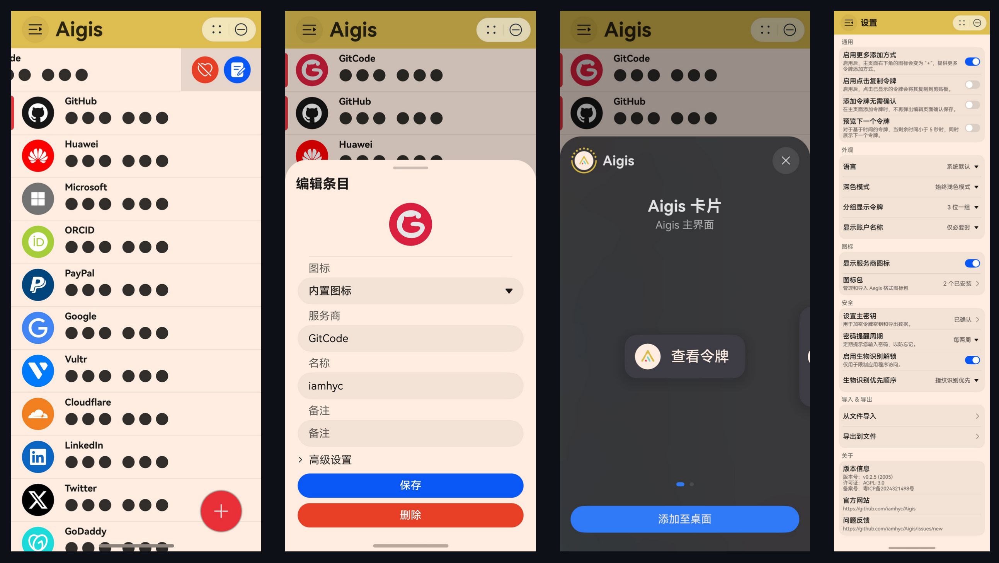
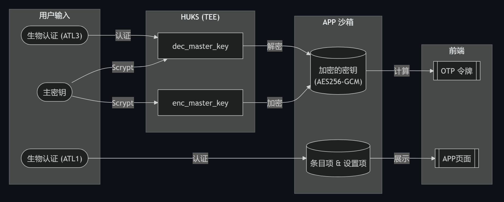
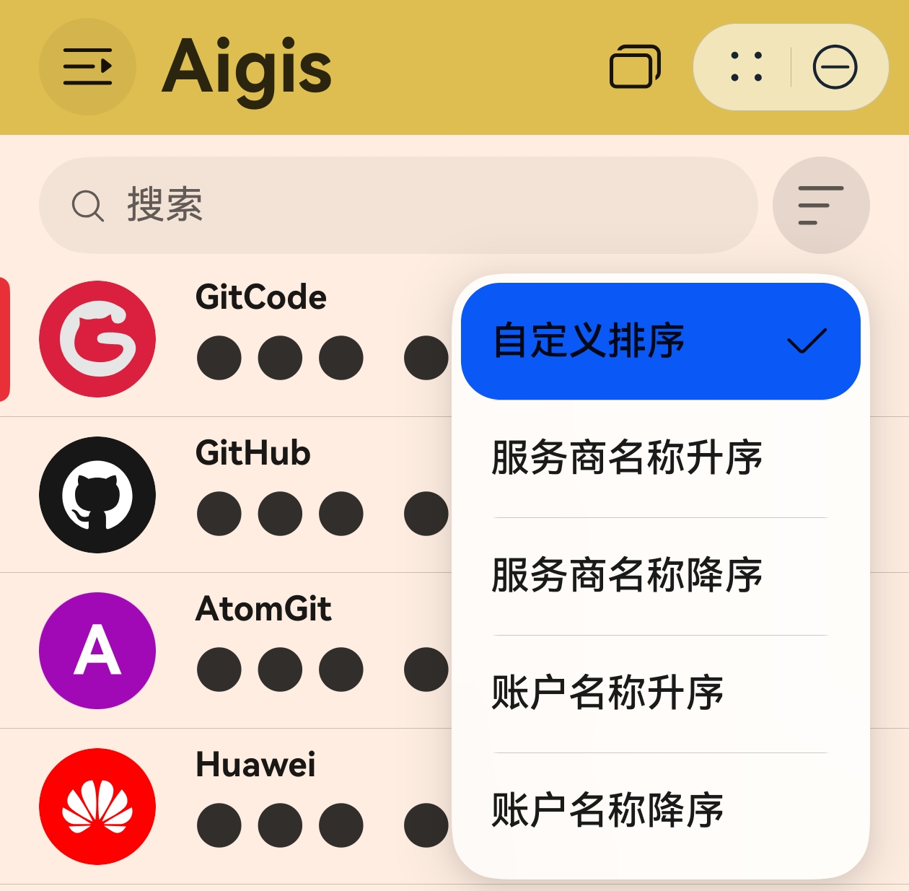
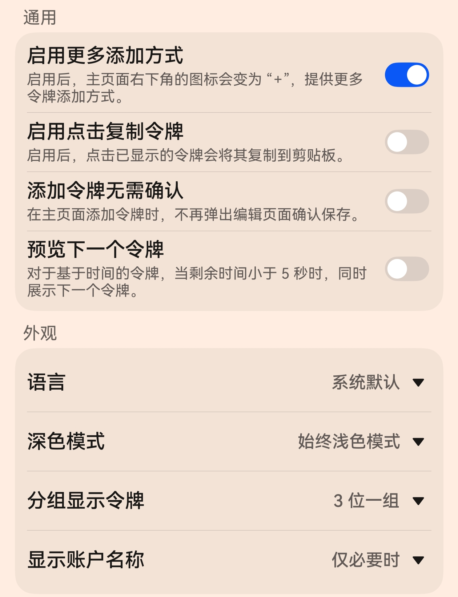
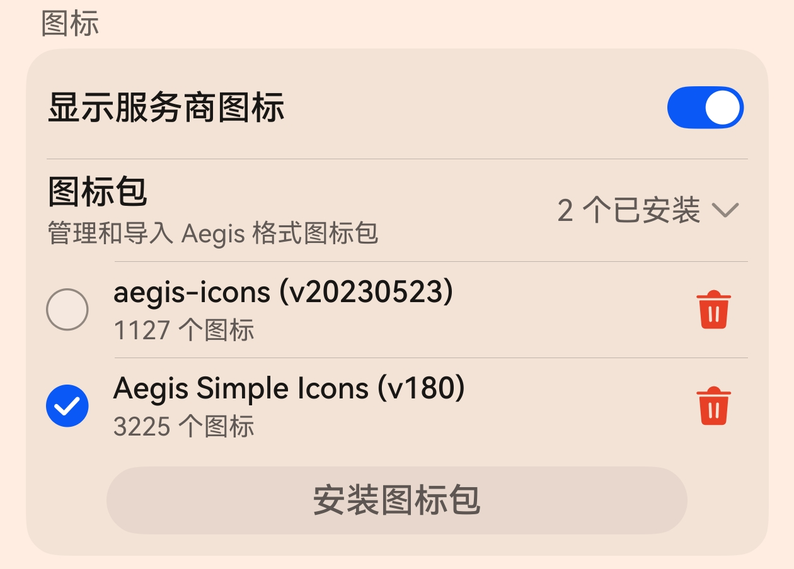
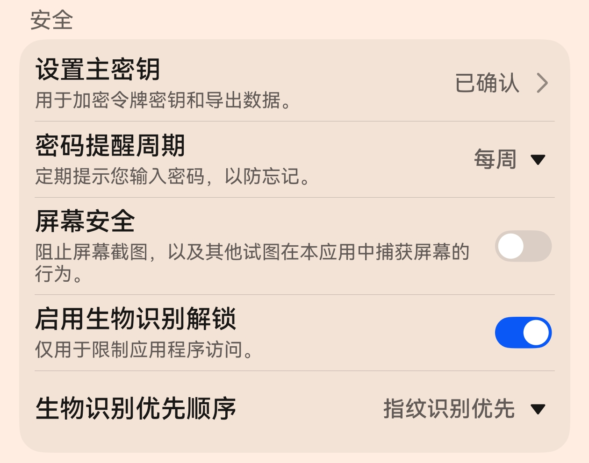
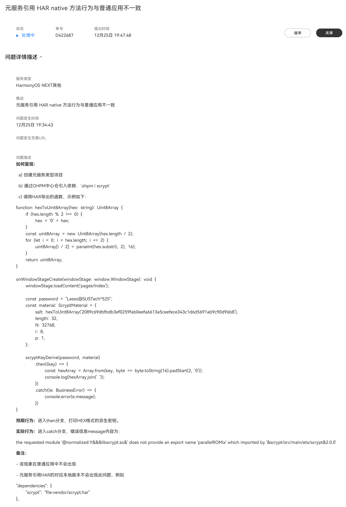

**前言：** HarmonyOS NEXT的生态建设真是一个巨坑，特别是对于 独立开发者与开源项目 来说，更不用说元服务面对普通应用天然劣势，简直是来自审核和竞品的双重压力。但是怀着不能让新兴平台被粗制滥造的应用所淹没的信念，我还是坚持把这个项目的主要功能完成了，版本号从 v0.1.0 数到了 v1.0.0。
🎉🎉🎉 **完结撒花** 🎉🎉🎉

> P.S. 截至本文章发布时，Aigis Authenticator v1.0.0 仍在审核中，虽然早于12月27日上午提交审核，但大概要被拖到2025年了 😅

## 项目简介

Aigis 是一个服务于 HarmonyOS NEXT 的 2FA 认证元服务，采用纯 ArkTS 实现，无任何三方依赖。

Aigis 的目标是成为安卓平台 [Aegis Authenticator](https://github.com/beemdevelopment/Aegis) 的轻量级替代品。当前，凭借不到 300KB 的安装包大小，Aigis 已实现了其超过 90% 的功能，且实现了存储数据格式的完整兼容，可以支持加密备份文件的相互导入导出。同时，Aigis 也在设计上做了一些改进，提供了更好的用户体验和数据安全性。

### 开发动机

我在 2024年9月 升级到 HarmonyOS NEXT beta 版本后，被迫放弃了大量安卓软件，以及忍受各种有缺陷的应用功能，但还是发现一个问题不能解决：**没有 [Aegis Authenticator](https://github.com/beemdevelopment/Aegis) 的替代品**。

当时的应用市场中，只有一个叫 “手机令牌” 的丑到爆的软件（目前竟然还在更新！还是那么丑！），还不存在同类竞品~~虽然之后卓易通的上架证明大家都是小丑🤡~~。同时，我本来计划开发一个 RetroArch 的鸿蒙前端，[Retrohos](../retrohos-development-logs-01-migrating-libretro-cores)，正好积累一下 GUI 的开发经验。于是我在国庆假期期间，快速学习了下 HarmonyOS NEXT 的开发文档，并在 假期结束前 完成了这个项目的核心功能：OTP 计算与展示功能。在于 10月9日 提交备案审核，10月15日 过审后，我于当日上架了 Aigis 的首个测试版本。

### 设计理念

Aigis 的主体设计语言参考了原版 [Aegis Authenticator](https://github.com/beemdevelopment/Aegis)，同时因为元服务的形态做出了一定调整；主题配色大致参考了Aigis。

主页列表条目参考了当前系统应用 *邮件* 的设计，编辑页面采用了 [Aegis Authenticator](https://github.com/beemdevelopment/Aegis) 的布局方案。设置页项条目参考了系统 *设置* 的设计，优先使用了系统提供的组件范式，以保证用户体验的一致性。

Aigis Authenticator 在设计中始终把 **安全** 放在第一位。

虽然相较于普通鸿蒙应用，元服务无法使用 Asset Kit 数据存储，系统备份，云同步等API，但这也从原理上保证了元服务的安全性：在没有网络权限的前提下，除非得到用户的许可，用户的数据无法从应用沙箱中逃逸。

相对的，在数据存储方面，Aigis 参考 [Aegis Authenticator](https://github.com/beemdevelopment/Aegis) 的设计，将条目密钥存储在文件中（用户首选项）。同时，用户需要设置主密钥，并经过经典 PBKDF2 派生算法，生成 AES-256 密钥并保存在可信执行环境（TEE）中，用于条目密钥的加解密使用。

在这一数据安全存储的机制下，Aigis 通过以下的一系列安全设计，保证用户对数据的绝对掌控：

- **条目/密钥分离存储**：在用户首选项文件中，条目和密钥分别存储，只对密钥进行加密，实现了 页面渲染效率（仅需条目）和 令牌计算（需要条目+密钥）的安全性 的平衡。在导出备份文件时，条目和密钥分别使用独立的密钥材料加密，进一步提升了数据的安全性。

- **加密/解密密钥分离设计**：得益于 HUKS 的设计，Aigis 将派生的主密钥存储在可信执行环境（TEE）中，并根据用途分为两个密钥：一个用于加密密钥（`enc_master_key`），不需要鉴权即可调用；另一个用于解密密钥（`dec_master_key`），严格限制在应用中调用，在 v2.0.0 之后支持在 ATL3 级别安全验证之后才可以调用。

- **加密JSON文件备份**：用户在设置主密钥后，可以导出加密的 JSON 格式数据文件，用于备份或者迁移到另一 Aigis 实例中。同时，用户可在 PC 或其他设备上，通过输入主密钥并调用 PBKDF2 算法，自由解密数据文件。

- **生物识别解锁**：Aigis 支持 ATL1 级别的生物识别解锁应用界面，同时允许设置 面部/指纹/PIN码 用于解锁的优先级。与 [Aegis Authenticator](https://github.com/beemdevelopment/Aegis) 不同的是，Aigis 在未设置主密钥时也支持启用生物解锁，该情况下您的密钥仍以明文存储在应用沙箱中。从 v2.0.0 开始，Aigis 将支持 ATL3 级别的生物解锁，该安全性将与 [Aegis Authenticator](https://github.com/beemdevelopment/Aegis) 生物解锁安全性等价。

- **隐私窗口保护**：Aigis 默认不允许截屏、屏幕录制、任意拖拽内容，以避免可能的个人信息泄露；另一方面，从 v0.8.0 版本开始，用户在设置主密钥后，可以设置禁用隐私窗口保护，以便在需要时截屏。（需要注意的是，在设置主密钥后，条目的二维码分享功能将会被自动禁用）

### 特性一览

- **主页面列表，支持条目拖拽排序，搜索，置顶**

  

- **编辑页面支持 二维码分享 条目**
  - 仅当主密钥未设置时，设置主密钥后，分享功能将被自动禁用

- **通用/外观设置，对齐 [Aegis Authenticator](https://github.com/beemdevelopment/Aegis) 界面定制需求**

  

- **支持 Aegis 格式图标包导入**

  

- **主密钥设置，密码周期提醒，屏幕安全，生物识别解锁**

  

- **扫码支持 Google Authenticator 二维码导入导出**
  - 纯 ArkTS 实现 `otpauth-migration` payload Protobuf 编解码

- **支持 [Aegis Authenticator](https://github.com/beemdevelopment/Aegis) 加密备份文件导入导出**

## 开发避坑指南

> 以下内容仅涉及本人在开发 Aigis 过程中摸索遇到的问题，并不全面，仅供参考。

### 开发文档的获取

虽然论坛里很多吐槽开发文档不好查看，查找一个API的用法要跳转好几个页面（事实也确实如此），但是这个开发文档是和 [OpenHarmony文档](https://docs.openharmony.cn/pages/v5.0/zh-cn/application-dev/application-dev-guide.md) 保持一致的，所以在查看文档时需要分清主次。

首先，[指南](https://developer.huawei.com/consumer/cn/doc/harmonyos-guides-V5/arkui-overview-V5?catalogVersion=V5) 和 [API参考](https://developer.huawei.com/consumer/cn/doc/harmonyos-guides-V5/arkui-overview-V5?catalogVersion=V5)，这两个和 OpenHarmony 保持一致，随版本号发布（虽然 OpenHarmony 网站只放出了 5.0.0 的文档，但 5.0.1 (API 13) 的文档在 [gitee仓库](https://gitee.com/openharmony/docs/tree/OpenHarmony-5.0.1-Release/) 确实是存在的）。

其次，[最佳实践](https://developer.huawei.com/consumer/cn/doc/best-practices-V5/bpta-harmonyos-features-V5?catalogVersion=V5) 和 [FAQ](https://developer.huawei.com/consumer/cn/doc/harmonyos-faqs-V5/faqs-ux-design-V5?catalogVersion=V5)，这两个是 HarmonyOS NEXT 特有的文档，更新频率会高一些（也没高多少），主要是对开发文档的缺失部分做快速的补充，但具体功能的缺陷解决和特性，目前来看还是要等上游 OpenHarmony 发版之后才能同步。另外，[变更预告](https://developer.huawei.com/consumer/cn/doc/harmonyos-roadmap-V5/changelogs-pre-V5?catalogVersion=V5) 也有一定用处，但我是看一次失望一次，反正是没修复过我提到的问题。

除此之外，在线文档页面的“智能客服”以及全局搜索功能，也有一定用处，但是不要抱太大希望，毕竟现在生态还在建设中，很多问题都是需要自己摸索。

### 备案与软件著作权

**关于备案**：满足两个条件，单机 + 元服务，就不需要备案了；但是需要内置应用启动时弹出的“用户协议”和“隐私协议”，具体内容请参考现有应用的协议，也可以搜索论坛里的帖子，有人分享过。如果是其他情况，则一定需要备案，建议在应用启动开发时，就开始启动这个流程；这样在应用基本功能完成时，备案也差不多完成审核了。

**关于软件著作权**：元服务不需要软件著作权，应用需要软件著作权，但也可以用电子版权证书代替；不想让代理公司赚钱，可以自己申请，但是时间要长一些。

### 工单系统的重要性

在开发过程中，遇到疑似 API缺陷/文档缺陷 的问题，首先请在在开发者联盟论坛里搜索一下, 看看有没有人遇到过类似的问题。

如果没有的话，建议也不要再发帖了，而是直接在开发者联盟的工单系统里提交工单，这样可以更快的得到官方的回复。

虽然工单系统的回复也是千篇一律的客服复制粘贴文档，但如果问题确实存在的话，还是会上升到开发团队的视野里，有可能会得到解决。

而如果是关于应用上架遇到问题，则需要在 AppGalley Connect 的“互动中心”提交工单，这样可以更快的得到审核人员的回复。

### HUKS 密钥管理与使用

HUKS 的文档是存在各种缺陷的，它基于**设备**提供的 TEE 来实现，能力边界是和设备高度耦合的，但文档上却没体现这一点。直接影响就是，有些API在手机端根本没法用，但他们的测试却没有问题。

这里列举下我个人遇到的问题，论坛上的相关讨论是比较少的：

- **测试可用的**：密钥导入，密钥删除，密钥覆盖创建，AES 相关加解密操作，auth鉴权访问，我这边试过都是没问题的。如有需要的话，可以参考我封装自用的工具类 [HUKSUtils](https://github.com/iamhyc/Aigis/blob/master/entry/src/main/ets/crypto/huksUtils.ets)。
- **HMAC 方法最好不要用**，具体来说，也就是不要期待可以在 TEE 里完成基于 SHA1/SHA256 的，非标准密钥长度（256bit 之外）的 HMAC 操作；如果你不信的话，可以写个测试用例试试，如果能用的话也可以告诉我一声 ：）
- **密钥派生方法：强烈建议不要使用！** 首先，它只有 PBKDF2 派生算法，还不是标准实现！它的派生密钥是不能在其他设备上重复生成的，而是和TEE里的AES密钥及不可控的加密参数相关！鸿蒙使用了私有的派生算法，这个算法的安全性和可靠性都是未知的，不建议使用！
  
  考虑到当前 ArkTS 虚拟机对于加密算法的效率问题，推荐使用 openssl 绑定的加密库，如 [@ohos-rs/openssl](https://ohpm.openharmony.cn/#/cn/detail/@ohos-rs%2Fopenssl)，或者我手搓了一个 [Scrypt](https://ohpm.openharmony.cn/#/cn/detail/scrypt) 密钥派生算法（仅8KB大小）。

### ArkTS 虚拟机效率问题

正如上面提到的，ArkTS 虚拟机对于加密算法的效率问题，是一个很大的问题。早在API 10的版本，就有人反馈过 [@ohos/crypto-js 加解密卡死](https://gitee.com/openharmony-sig/ohos_crypto_js/issues/IAS9PA?from=project-issue) 的问题，但直到目前为止，官方还没有给出解决方案。

我曾经在论坛提出这个问题，[ArkTS 计算密集任务（XOR运算）效率低下](https://developer.huawei.com/consumer/cn/forum/topic/0207168721096647879)，同时也在工单系统提问，但最后的结论是，必须把相关代码切换到 Native 实现，AOT当前是无法启用的（更不用说JIT）。

另一方面，华为也在推广 Cangjie 作为 ArkTS 的接班人，但从我的角度来看，Cangjie 的审美比 TypeScript 或者 Rust 都差远了，而且它的文档也是一团糟，API 也还没有和 ArkTS 保持一致，谁爱用谁用吧 ╮(╯▽╰)╭

### 元服务 Native 开发与 Native 方法调用

元服务是不允许创建 Native Module 的，也就是说不能在 元服务项目 里创建/编译含 Native 代码的 HAR/HSP module。但是，元服务可以通过引用 HAR/HSP 模块，调用 Native 方法 …… 很明显所谓不能创建 Native Module只是 DevEco Studio 的缺陷，元服务的地位之低可见一斑。

在元服务里调用 Native 方法，需要注意：对于含有 Native 模块的 HAR/HSP 模块，元服务不能通过 在线 方式引用，而需要把对应的库放在本地，然后通过本地引用的方式来调用，不然会无法找到 NAPI 暴露的方法，报错如：`the requested module '@normalized:Y&&&libscrypt.so&' does not provide an export name 'parallelROMix' which imported by '&scrypt/src/main/ets/scrypt&2.0.0'`。
而神奇的是，对于普通应用，则完全没有这个问题。

这个问题我也提过工单了，就是到现在还没人理 😅

## 心路历程

这个吐槽部分放在最后，只是来看技术的读者可以直接跳过。

2024年12月31日前，HarmonyOS NEXT的生态进展只有一个主旋律：**冲量**。

**企业开发者方面：** 先是威逼利诱头部厂商，做出99%的日常应用；然后上架 卓易通/出境易 安卓虚拟机，补齐剩下的小众软件境外软件。

**个人开发者方面：** 开发者激励计划，放出大量红利，吸引大数量应用上架（即使大部分粗制滥造），元服务上架甚至不需要软著和备案；然后再提高门槛，把上车晚的无法引流的垃圾元服务下架，省一点是一点。另一方面，官方的开发者联盟论坛直到今天为止，仍然有大量疑似官方的水军账号大量复制粘贴自导自演的发帖，把正常的虽然比较少的正常开发者的讨论与提问淹没。

**消费者方面：** 先是发放各种合作厂商的会员月卡/季卡，再是直接送钱充话费电费交通卡；最后24年快过去了，API 14 先支持 Nova 12/13 用户升级需求，能拉一点升级率算一点。

可以看出，华为的人力和财力，都花在了**在2024年结束前完成 转化率 留存率 活跃度 KPI上**；至于生态的质量以及后续发展，真不好说这是否算正面的影响。

这一切的行为导向，让我在开发这个项目的时候，不断感受到无力与被歧视。首先，API 13/14 的推出，很明显是为了服务头部厂商（比如微信）的反馈（API 13），以及提高用户的升级率的需求（API 14），个人开发者反馈的问题几乎不能得到修复，比如 HUKS 的各种文档缺失以及 ArkTS 的效率低下。

其次，元服务的生态地位堪忧，虽然官方一直在强调元服务与普通应用一体两面，能给用户带来更独特的体验，但截至目前为止，元服务简介内容不能被应用市场索引，曾一度[被禁止上架公开测试](https://github.com/iamhyc/Aigis/issues/30#issuecomment-2505244270)（一个很好免费的获流渠道直到被垃圾元服务开发者滥用），不能使用鸿蒙碰一碰分享（ShareKit），不能接入意图框架，卡片加桌API存在缺陷不能触发刷新，商店审核被其他应用插队 …… 等等诸多限制，只能看出官方对元服务生态的漠视。
大概“待到山花烂漫时”，元服务也就算个肥料罢了，真不知道发的 300 块元服务优惠券到底肥了谁的钱包。

总而言之，经历了这么多波折，我还是完成了这个项目。等这波撒钱/骗钱的热度过去，再看看鸿蒙生态的未来在哪里吧，至少我现在对它是十分失望的（手持 HUAWEI Pura 70 Pro Plus 光织银 16+512GB 原价购入用户 作答 😅）。
