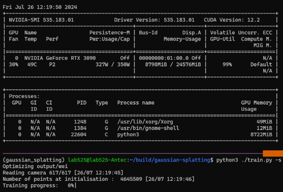

> 以下内容使用 [deepl.com](deel.com) 机翻辅助，如有不适请参考英文版本。

我很奇怪为什么没有人发现这个内存泄漏问题。也许是我太懒了，没有在网上翻到。
总之，我发现在原始实现中存在明显的内存泄漏问题（其源代码可在 [Github](https://github.com/graphdeco-inria/gaussian-splatting) 上获取）。

我在加载一个大型数据集时发现了这个问题，该数据集包含约 600 的图像和 400 万的点云数据，这些图像和点是通过精确的几何映射收集的。训练时占用了NVIDIA RTX 3090 GPU 20GB 以上的显存，同时还占用了 15GB 以上的内存。虽然场景确实很大，但我很好奇为什么一开始就占用了所有内存，而不是在训练过程中逐渐增加！

## 第一个补丁 - 延迟加载

首先，我找出了 CPU 占用大量内存（即 RAM 占用）的原因：一开始，所有图像的都在 RAM 中被加载，并在 GPU 上创建了相应的张量。相关源代码见 [`utils/camera_utils.py#L20`](https://github.com/graphdeco-inria/gaussian-splatting/blob/main/utils/camera_utils.py#L20)：

```python
def loadCam(args, id, cam_info, resolution_scale, is_test_dataset):

  ...

  return Camera(resolution, colmap_id=cam_info.uid, R=cam_info.R, T=cam_info.T, 
                  FoVx=cam_info.FovX, FoVy=cam_info.FovY, depth_params=cam_info.depth_params,
                  image=image, invdepthmap=invdepthmap,
                  image_name=cam_info.image_name, uid=id, data_device=args.data_device,
                  train_test_exp=args.train_test_exp, is_test_dataset=is_test_dataset, is_test_view=cam_info.is_test)
```
我的直接想法是进行权衡：图像加载时间可能不值得消耗这么多内存，尤其是考虑到后续的巨大训练负担。
因此，我编写了一个 `LazyLoader` 类，将 `Camera` 类的实例化延迟到第一次引用。实现示例如下：

```python
from scene.cameras import Camera

class LazyLoader:
    def __init__(self, cls, *args, **kwargs):
        self.cls = cls
        self.args = args
        self.kwargs = kwargs
        self.instance = None
        pass

    def __getattribute__(self, name: str):
        if name in ['cls', 'args', 'kwargs', 'instance']:
            return super().__getattribute__(name)
        else:
            if not self.instance:
                self.instance = self.cls(*self.args, **self.kwargs)
            return getattr(self.instance, name)

    def __del__(self):
        if self.instance:
            del self.instance
        pass

    pass
```

因此，`Camera` 类构建的原始引用修改为
```diff
-    return Camera(colmap_id=cam_info.uid, R=cam_info.R, T=cam_info.T, 
+    return LazyLoader(Camera, colmap_id=cam_info.uid, R=cam_info.R, T=cam_info.T, 
```

在 `train.py` 中的主训练循环中使用后，图像会被立即删除，直到下一次使用再被创建。
```diff
             # Loss
             gt_image = viewpoint_cam.original_image.cuda()
+            del viewpoint_cam
             Ll1 = l1_loss(image, gt_image)
             loss = (1.0 - opt.lambda_dssim) * Ll1 + opt.lambda_dssim * (1.0 - ssim(image, gt_image))
             loss.backward()
```

然而，奇怪的是，内存使用量在开始时确实是可以接受的，图像会按照预期逐个加载。但最后却增加到了 20GB 以上，之后从未减少过。所以我意识到真正的问题是内存泄漏。

## 第二个补丁 - 内存泄漏修复

这里的内存泄漏非常令人困惑。正如我之前提到的，我在 Python 中使用 `del` 来删除对 `Camera` 类的引用，所有的内存应该同时被清除。我试图到处寻找原因，但只发现它与 PyTorch 有关。由于无法深入研究 CUDA 张量，我开始尝试在 Python 代码中的 `del` 所有相关内容。幸运的是，它成功了。

补丁可分为两部分。第一部分是继续提高图像加载的效率：

```diff
diff --git a/scene/__init__.py b/scene/__init__.py
--- a/scene/__init__.py
+++ b/scene/__init__.py
@@ -37,9 +37,6 @@ class Scene:
                 self.loaded_iter = load_iteration
             print("Loading trained model at iteration {}".format(self.loaded_iter))
 
-        self.train_cameras = {}
-        self.test_cameras = {}
-
         if os.path.exists(os.path.join(args.source_path, "sparse")):
             scene_info = sceneLoadTypeCallbacks["Colmap"](args.source_path, args.images, args.eval)
         elif os.path.exists(os.path.join(args.source_path, "transforms_train.json")):
@@ -67,12 +64,8 @@ class Scene:
             random.shuffle(scene_info.test_cameras)  # Multi-res consistent random shuffling
 
         self.cameras_extent = scene_info.nerf_normalization["radius"]
-
-        for resolution_scale in resolution_scales:
-            print("Loading Training Cameras")
-            self.train_cameras[resolution_scale] = cameraList_from_camInfos(scene_info.train_cameras, resolution_scale, args)
-            print("Loading Test Cameras")
-            self.test_cameras[resolution_scale] = cameraList_from_camInfos(scene_info.test_cameras, resolution_scale, args)
+        self.scene_info = scene_info
+        self.args = args
 
         if self.loaded_iter:
             self.gaussians.load_ply(os.path.join(self.model_path,
@@ -87,7 +80,7 @@ class Scene:
         self.gaussians.save_ply(os.path.join(point_cloud_path, "point_cloud.ply"))
 
     def getTrainCameras(self, scale=1.0):
-        return self.train_cameras[scale]
+        return cameraList_from_camInfos(self.scene_info.train_cameras, scale, self.args)
 
     def getTestCameras(self, scale=1.0):
-        return self.test_cameras[scale]
\ No newline at end of file
+        return cameraList_from_camInfos(self.scene_info.test_cameras, scale, self.args)
\ No newline at end of file
diff --git a/scene/cameras.py b/scene/cameras.py
--- a/scene/cameras.py
+++ b/scene/cameras.py
@@ -17,6 +17,7 @@ from utils.graphics_utils import getWorld2View2, getProjectionMatrix
 class Camera(nn.Module):
     def __init__(self, colmap_id, R, T, FoVx, FoVy, image, gt_alpha_mask,
                  image_name, uid,
+                 raw_image=None,
                  trans=np.array([0.0, 0.0, 0.0]), scale=1.0, data_device = "cuda"
                  ):
         super(Camera, self).__init__()
@@ -29,6 +30,14 @@ class Camera(nn.Module):
         self.FoVy = FoVy
         self.image_name = image_name
 
+        if raw_image is not None:
+            image = raw_image[:3, ...]
+            gt_alpha_mask = None
+
+            if raw_image.shape[1] == 4:
+                gt_alpha_mask = raw_image[3:4, ...]
+            del raw_image
+
         try:
             self.data_device = torch.device(data_device)
         except Exception as e:
@@ -39,9 +48,11 @@ class Camera(nn.Module):
         self.original_image = image.clamp(0.0, 1.0).to(self.data_device)
         self.image_width = self.original_image.shape[2]
         self.image_height = self.original_image.shape[1]
+        del image
 
         if gt_alpha_mask is not None:
             self.original_image *= gt_alpha_mask.to(self.data_device)
+            del gt_alpha_mask
         else:
             self.original_image *= torch.ones((1, self.image_height, self.image_width), device=self.data_device)
 
@@ -56,6 +67,9 @@ class Camera(nn.Module):
         self.full_proj_transform = (self.world_view_transform.unsqueeze(0).bmm(self.projection_matrix.unsqueeze(0))).squeeze(0)
         self.camera_center = self.world_view_transform.inverse()[3, :3]
 
+    def __del__(self):
+        del self.original_image, self.world_view_transform, self.projection_matrix, self.full_proj_transform, self.camera_center
+
 class MiniCam:
     def __init__(self, width, height, fovy, fovx, znear, zfar, world_view_transform, full_proj_transform):
         self.image_width = width
diff --git a/train.py b/train.py
--- a/train.py
+++ b/train.py
@@ -44,103 +43,82 @@ def training(dataset, opt, pipe, testing_iterations, saving_iterations, checkpoi
     iter_start = torch.cuda.Event(enable_timing = True)
     iter_end = torch.cuda.Event(enable_timing = True)
 
-    viewpoint_stack = None
+    viewpoint_stack = scene.getTrainCameras()
     ema_loss_for_log = 0.0
     progress_bar = tqdm(range(first_iter, opt.iterations), desc="Training progress")
     first_iter += 1
```

第二部分是在主训练循环中使用 `del`。因为我对训练过程做了其他修改，因此无法在此给出完整的补丁。缩减版如下。

```python
for iteration in range(first_iter, opt.iterations + 1):
    iter_start.record()

    gaussians.update_learning_rate(iteration)

    # Every 1000 its we increase the levels of SH up to a maximum degree
    if iteration % 1000 == 0:
        gaussians.oneupSHdegree()

    # Pick a random Camera
    if len(viewpoint_stack)==0:
        del viewpoint_stack
        viewpoint_stack = scene.getTrainCameras()

    viewpoint_cam = viewpoint_stack.pop(randint(0, len(viewpoint_stack)-1))

    # Render
    if (iteration - 1) == debug_from:
        pipe.debug = True

    bg = torch.rand((3), device="cuda") if opt.random_background else background

    render_pkg = render(viewpoint_cam, gaussians, pipe, bg)
    image, viewspace_point_tensor, visibility_filter, radii = render_pkg["render"], render_pkg["viewspace_points"], render_pkg["visibility_filter"], render_pkg["radii"]

    # Loss
    gt_image = viewpoint_cam.original_image.cuda()
    Ll1 = l1_loss(image, gt_image)
    loss = (1.0 - opt.lambda_dssim) * Ll1 + opt.lambda_dssim * (1.0 - ssim(image, gt_image))
    loss.backward()

    iter_end.record()

    with torch.no_grad():
        # Progress bar
        ema_loss_for_log = 0.4 * loss.item() + 0.6 * ema_loss_for_log
        if iteration % 10 == 0:
            progress_bar.set_postfix({"Loss": f"{ema_loss_for_log:.{7}f}"})
            progress_bar.update(10)
        if iteration == opt.iterations:
            progress_bar.close()

        # Log and save
        torch.cuda.empty_cache()
        if (iteration in saving_iterations):
            print("\n[ITER {}] Saving Gaussians".format(iteration))
            scene.save(iteration)

        # Densification
        if iteration < opt.densify_until_iter:
            # Keep track of max radii in image-space for pruning
            gaussians.max_radii2D[visibility_filter] = torch.max(gaussians.max_radii2D[visibility_filter], radii[visibility_filter])
            gaussians.add_densification_stats(viewspace_point_tensor, visibility_filter)

            if iteration > opt.densify_from_iter and iteration % opt.densification_interval == 0:
                size_threshold = 20 if iteration > opt.opacity_reset_interval else None
                gaussians.densify_and_prune(opt.densify_grad_threshold, 0.005, scene.cameras_extent, size_threshold)

            if iteration % opt.opacity_reset_interval == 0 or (dataset.white_background and iteration == opt.densify_from_iter):
                gaussians.reset_opacity()

        # Optimizer step
        if iteration < opt.iterations:
            gaussians.optimizer.step()
            gaussians.optimizer.zero_grad(set_to_none = True)

        if (iteration in checkpoint_iterations):
            print("\n[ITER {}] Saving Checkpoint".format(iteration))
            torch.save((gaussians.capture(), iteration), scene.model_path + "/chkpnt" + str(iteration) + ".pth")

        del viewpoint_cam, image, viewspace_point_tensor, visibility_filter, radii, gt_image, Ll1, loss, render_pkg
```

在打了两个补丁之后，内存使用量终于得到了控制。在我们的案例中，GPU 内存使用量可以控制在 10GB 以下。



## 结论

我不确定是否应该向原始版本库报告这个问题。因为在过去的一年里，人们并没有意识到内存泄漏问题，所以我不确定这是否是一个普遍问题，或者只是我的情况。总之，我希望这篇文章能帮助正在为同样问题而苦恼的人。
